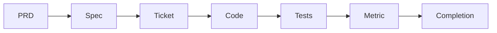

# Agentic Development Operating System

A governed, traceable, measurable repository starter for teams building software with AI agents.

This project turns product intent into bounded execution:



It includes working validation, event collection, metric summaries, architecture boundaries, CI gates, templates, and a complete example trace chain. It has no runtime dependencies beyond Python 3.11+.

## Quick start

```bash
make verify
make demo
```

`make verify` checks tests, traceability, repository structure, ticket scope, architecture boundaries, and telemetry. `make demo` emits a sample loop lifecycle and writes a report to `docs/metrics/latest.md`.

## Daily workflow

1. Copy a template from `docs/*/TEMPLATE.md`.
2. Assign stable IDs: `PRD-NNN`, `SPEC-NNN`, `TICKET-NNN`, `TEST-NNN`, and `METRIC-NNN`.
3. Add the relationship to `docs/trace/traceability.json`.
4. Start the loop: `python scripts/ados.py loop-start --ticket TICKET-001`.
5. Make only the ticket's allowed changes.
6. Run `make verify`.
7. Finish the loop: `python scripts/ados.py loop-stop --ticket TICKET-001 --outcome success`.
8. Update completion notes and the trace record status.

## Commands

| Command | Purpose |
| --- | --- |
| `make verify` | Run every local governance gate |
| `make test` | Run unit and architecture tests |
| `make validate` | Validate artifacts, traces, scopes, and events |
| `make demo` | Emit demo events and build a metric report |
| `python scripts/ados.py new-ticket --id TICKET-002 --title "Example"` | Create a ticket from the template |
| `python scripts/ados.py metrics` | Rebuild the human-readable metric report |

## Repository map

| Path | Contract |
| --- | --- |
| `docs/prd/` | Product intent and stable requirements |
| `docs/specs/` | Architecture, interfaces, acceptance criteria, tests |
| `docs/tickets/` | One bounded executable slice per file |
| `docs/trace/` | Machine-readable requirement-to-outcome links |
| `agent/` | Agent rules, risk policy, and loop contracts |
| `scripts/ados.py` | Local CLI for validation, loops, metrics, and scaffolding |
| `observability/` | Event schema, event stream, and dashboard definition |
| `tests/` | Behavioral and governance tests |
| `.github/workflows/` | Pull-request enforcement |

## Adoption

Start in shadow mode: agents propose a ticket plan and file scope, while a human executes or approves it. Move low-risk, reversible work to autonomous execution only after the metrics show reliable first-pass success and low intervention. See [adoption](docs/specs/SPEC-002-adoption.md) and [growth strategy](docs/growth/strategy.md).

## Design principles

- Evidence over memory.
- One objective, one scope, one verification path.
- Stable IDs and bidirectional traceability.
- Least privilege and risk-tiered approvals.
- Outcome metrics alongside throughput metrics.
- Exceptions are explicit; ambiguous work does not get forced through a narrow loop.

## License

MIT. See [LICENSE](LICENSE).
