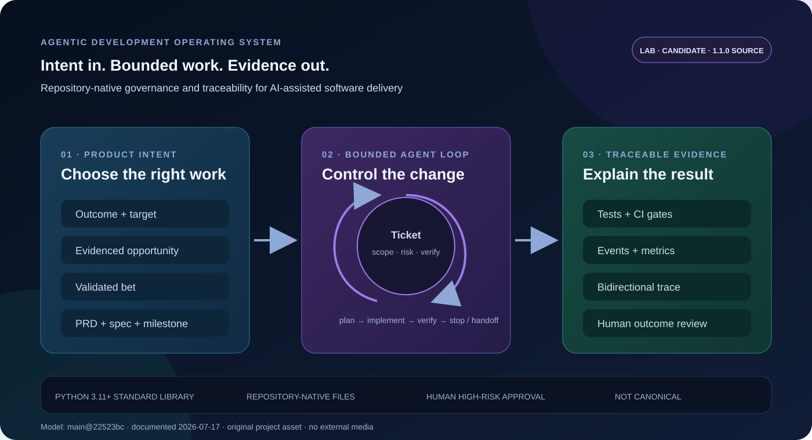
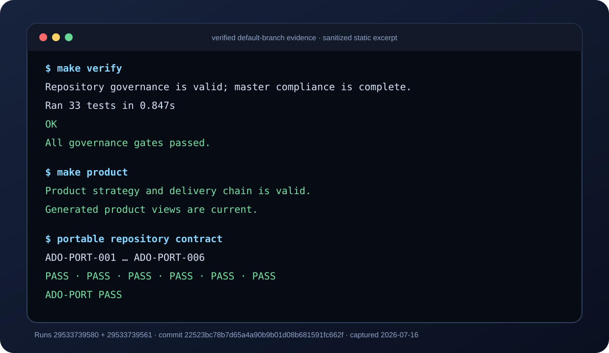

# Agentic Development Operating System

A repository-native operating system for developers and small teams using AI agents to build software while preserving product intent, bounded scope, verification, and outcome evidence.

> [!IMPORTANT]
> **Status: Lab-stage, supported portfolio pilot candidate.** The source declares version `1.1.0`, but there is no tag, release, package, or supported version line. This is **not** the canonical portfolio harness and is not production-proven. Evaluate an immutable commit SHA, not the source-version label.

**Audience:** AI-native product and engineering teams, platform teams, developer-tool maintainers, and teams with traceability or audit requirements.

**Outcome:** A change can explain why it exists, which scope and risk controls applied, how it was verified, and which outcome it should improve.



*Documentation diagram for `main@22523bc78b7d65a4a90b9b01d08b681591fc662f`, created 2026-07-17. It explains the implemented repository model; it is not execution proof. Original project asset with no external media.*

## What it provides

- A product chain from measurable outcomes and evidenced opportunities to bets, PRDs, specs, tickets, code, tests, metrics, and human review.
- Bounded agent loops with explicit file scope, risk tiers, digest-bound approvals, retry limits, and stop conditions.
- Dependency-free Python validation for traceability, architecture boundaries, generated views, telemetry, and governance contracts.
- GitHub Actions gates, synthetic observability data, metric summaries, alerts, and a static HTML dashboard.
- Repository-native Markdown and JSON artifacts that remain readable without a hosted service.

It does not install itself into other repositories, coordinate an entire portfolio, authorize autonomous production work, or replace human product and security judgment.

## Run the current source

Prerequisites: Python 3.11+, Git, GNU Make, and a Unix-like shell.

```bash
git clone https://github.com/GhostlyGawd/agentic-dev-os.git
cd agentic-dev-os
make verify
make product
```

`make verify` compiles and lints the Python source, validates repository contracts, and runs unit, negative-path, architecture, and end-to-end tests. `make product` validates the product-to-delivery chain and confirms generated compatibility views are current.

These commands run in GitHub Actions on Ubuntu with Python 3.11. This is a source verification path, not a package installer or proven cross-repository adoption path. No five-minute claim is made: an unfamiliar-user clean-room setup test is still required.

### Verified terminal evidence



*Sanitized static rendering of actual output from [Governance run 29533739580](https://github.com/GhostlyGawd/agentic-dev-os/actions/runs/29533739580) and [Portable Repository Contract run 29533739561](https://github.com/GhostlyGawd/agentic-dev-os/actions/runs/29533739561), both for `22523bc78b7d65a4a90b9b01d08b681591fc662f` on 2026-07-16. The layout is original; command results are copied from those logs.*

For a local synthetic demonstration after verification:

```bash
make demo
```

The demo writes synthetic loop events, metrics, alerts, and `observability/reports/dashboard.html`. It demonstrates repository machinery, not production use or external adoption.

## Governed workflow

1. Orient from `.ai/context/` and `.ai/strategy/`.
2. Define a measurable outcome and record an evidenced opportunity.
3. Test assumptions and advance only a bounded bet with success and kill criteria.
4. Create a canonical PRD, specification, milestone, and ticket.
5. Start a loop only when scope, risk, verification, and approvals are valid.
6. Implement within the ticket boundary, verify, and record trace and telemetry evidence.
7. Close, hand off, or iterate through human outcome review.

`Outcome → Opportunity → Bet → PRD requirement → Spec criterion → Milestone/Ticket → Code → Test → Event → Metric → Review → Completion`

See [Architecture and limitations](docs/ARCHITECTURE.md) for component boundaries, data flow, unsupported cases, and recovery guidance.

## Common commands

| Command | Purpose |
| --- | --- |
| `make verify` | Run every local governance gate and test |
| `make product` | Validate the product chain and generated views |
| `make test` | Run unit and architecture tests |
| `make demo` | Emit synthetic demo events and build metric evidence |
| `python scripts/ados.py loop plan --ticket TICKET-001` | Produce a ticket's bounded plan |
| `python scripts/ados.py loop start --ticket TICKET-001` | Start a valid governed loop |
| `python scripts/ados.py loop verify --ticket TICKET-001` | Run allowlisted ticket verification |
| `python scripts/ados.py trace-query --id PRD-001-R08` | Perform impact analysis |
| `python scripts/ados.py scope-check --ticket TICKET-001 FILE...` | Enforce allowed-file scope |
| `python scripts/ados.py product validate` | Validate strategy-to-delivery ancestry |
| `python scripts/ados.py product export --check` | Check deterministic generated views |
| `python scripts/ados.py metrics` | Rebuild metrics and the static dashboard |

## Repository map

| Path | Contract |
| --- | --- |
| `.ai/context/` and `.ai/strategy/` | Context, outcomes, guardrails, and roadmap |
| `.ai/discovery/`, `.ai/bets/`, `.ai/milestones/` | Evidence, hypotheses, and reviewable increments |
| `.ai/requirements/` | Generated compatibility views; never edit directly |
| `docs/prd/`, `docs/specs/`, `docs/tickets/` | Intent, acceptance, and bounded execution |
| `docs/trace/` | Machine-readable requirement-to-outcome links |
| `agent/` | Agent rules, risk policy, approvals, and loop contracts |
| `src/agentic_os/` | Validation, governance, metrics, and telemetry library |
| `scripts/ados.py` | Local command-line interface |
| `observability/` | Synthetic events, metrics, alerts, and dashboard |
| `.github/workflows/` | Pull-request, portability, and security enforcement |

## Adoption boundary

Start in shadow mode: agents propose ticket scope and verification while a human executes or approves the work. Move only low-risk, reversible work toward autonomy after local evidence shows reliable results.

A reusable harness learning requires product evidence, an acceptance test, validation in two unlike consumers, an explicit version decision, and separately reviewable consumer pull requests. This repository has not completed that round trip. See the [pilot adoption contract](docs/pilot/ADOPTION_CONTRACT.md).

## Security and privacy

The Python core has no required runtime dependency or hosted backend. Repository files, tickets, telemetry, and agent-generated instructions remain untrusted input. Do not put credentials, personal data, client data, production data, or private research in artifacts, events, examples, captures, or issues.

The source snapshot is not a hardened production boundary. Read [SECURITY.md](SECURITY.md) and [data handling](agent/policies/data-handling.md); report vulnerabilities privately as instructed there.

## Project status and trust

- **Version:** source `1.1.0`; no tag, release, package, or stable support line.
- **Maturity:** Lab; supported pilot candidate; candidate-not-canonical.
- **License:** MIT. See [LICENSE](LICENSE).
- **Provenance:** See [Provenance and asset register](docs/PROVENANCE.md).
- **Contributions:** See [CONTRIBUTING.md](CONTRIBUTING.md).
- **Support:** See [SUPPORT.md](SUPPORT.md); no response-time SLA is promised.
- **Evidence assessment:** See [Productization status](docs/productization/STATUS.md).

## Current limitations

- No release, package, installer, supported upgrade channel, or migration tool.
- No independent clean-room or five-minute setup evidence.
- No production-use evidence or authorization to act as the portfolio-wide standard.
- Demo, dashboard, and committed metrics are synthetic framework evidence.
- Two-consumer learning validation and explicit versioning remain incomplete.
- Platform security and repository-setting gates require separate authorization.