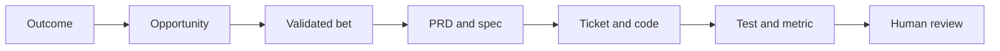

# Agentic Development Operating System

A governed, traceable, measurable product-delivery system for teams building software with AI agents. It connects product strategy and discovery to bounded implementation and operational proof.

This project turns product intent into bounded execution:



It includes working validation, event collection, metric summaries, architecture boundaries, CI gates, templates, and a complete example trace chain. It has no runtime dependencies beyond Python 3.11+.

## Quick start

```bash
make verify
make demo
```

`make verify` checks all 100 master obligations, the full product and delivery chain, deterministic generated views, artifact contracts, tool naming, ownership, architecture, telemetry, real lint rules, and positive/negative tests. `make demo` exercises a complete loop and generates metrics, alerts, JSON evidence, and a static HTML dashboard.

## Product workflow

1. Orient from `.ai/context/` and `.ai/strategy/`.
2. Define an `O-NNN` with metric, baseline, target, horizon, and guardrails.
3. Record an evidenced `OP-NNN` and test assumptions with `EXP-NNN`.
4. Advance a `BET-NNN` only after success, kill, and advance criteria are explicit.
5. Create a canonical PRD under `docs/prd/` and a reviewable `M-NNN`.
6. Execute through specs, tickets, governed loops, tests, metrics, and reviews.
7. Close or iterate using outcome evidence, findings, and change requests.

The enforced chain is:

`Outcome → Opportunity → Bet → PRD requirement → Spec criterion → Milestone/Ticket → Code → Test → Event → Metric → Review → Completion`

## Daily workflow

1. Copy a template from `docs/*/TEMPLATE.md`.
2. Confirm the linked outcome, opportunity, bet, and milestone under `.ai/`.
3. Assign stable delivery IDs: `PRD-NNN`, `SPEC-NNN`, `TICKET-NNN`, `TEST-NNN`, and `METRIC-NNN`.
4. Add the complete relationship to `docs/trace/traceability.json`.
5. Run `python scripts/ados.py product export` and `make product`.
6. Plan and start the loop: `python scripts/ados.py loop plan --ticket TICKET-001`, then `python scripts/ados.py loop start --ticket TICKET-001`.
7. Make only the ticket's allowed changes.
8. Record scoped actions and run `python scripts/ados.py loop verify --ticket TICKET-001`.
9. Finish the loop: `python scripts/ados.py loop stop --ticket TICKET-001 --outcome success`.
10. Update completion notes, review evidence, and the trace record status.

## Commands

| Command | Purpose |
| --- | --- |
| `make verify` | Run every local governance gate |
| `make product` | Validate the product chain and generated views |
| `make test` | Run unit and architecture tests |
| `make validate` | Validate artifacts, traces, scopes, and events |
| `make demo` | Emit demo events and build a metric report |
| `python scripts/ados.py new ticket --id TICKET-002 --title "Example"` | Create a ticket and emit its lifecycle event |
| `python scripts/ados.py metrics` | Rebuild the human-readable metric report |
| `python scripts/ados.py trace-query --id PRD-001-R08` | Perform forward/backward impact analysis |
| `python scripts/ados.py scope-check --ticket TICKET-001 FILE...` | Enforce the allowed-file boundary |
| `python scripts/ados.py approve ...` | Bind an R2/R3 approval to the exact ticket digest |
| `python scripts/ados.py archive --ticket TICKET-001` | Move completed work out of the active set |
| `python scripts/ados.py growth record ...` | Record organic funnel progress |
| `python scripts/ados.py product validate` | Validate strategy-to-delivery ancestry |
| `python scripts/ados.py product export` | Regenerate non-canonical requirement and CSV views |
| `python scripts/ados.py product gate --prd PRD-002` | Check whether a PRD may advance into planning |
| `python scripts/ados.py product metrics` | Report product-chain health |

## Repository map

| Path | Contract |
| --- | --- |
| `.ai/context/` | Project brief, users, language, and constraints |
| `.ai/strategy/` | North star, outcomes, guardrails, roadmap, and scorecard |
| `.ai/discovery/` | Evidenced opportunities, assumptions, research, and experiments |
| `.ai/bets/` | Bounded hypotheses with success and kill criteria |
| `.ai/milestones/` | Reviewable increments linking bets to PRDs and reviews |
| `.ai/commands/` | Portable workflow guidance from orientation through closure |
| `.ai/requirements/` | Generated compatibility views; never edit directly |
| `docs/prd/` | Product intent and stable requirements |
| `MASTER.md` | Controlling contract decomposed into 100 verified obligations |
| `docs/specs/` | Architecture, interfaces, acceptance criteria, tests |
| `docs/tickets/` | One bounded executable slice per file |
| `docs/trace/` | Machine-readable requirement-to-outcome links |
| `agent/` | Agent rules, risk policy, and loop contracts |
| `scripts/ados.py` | Local CLI for validation, loops, metrics, and scaffolding |
| `observability/` | Event schema, event stream, and dashboard definition |
| `tests/` | Behavioral and governance tests |
| `.github/workflows/` | Pull-request enforcement |

## Adoption

Start in shadow mode: agents propose a ticket plan and file scope, while a human executes or approves it. Move low-risk, reversible work to autonomous execution only after the metrics show reliable first-pass success and low intervention. See [adoption](docs/specs/SPEC-002-adoption.md) and [growth strategy](docs/growth/strategy.md).

## Design principles

- Evidence over memory.
- Product outcomes before implementation commitments.
- One canonical source for each fact; compatibility views are generated.
- One objective, one scope, one verification path.
- Stable IDs and bidirectional traceability.
- Least privilege and risk-tiered approvals.
- Outcome metrics alongside throughput metrics.
- Exceptions are explicit; ambiguous work does not get forced through a narrow loop.

## License

MIT. See [LICENSE](LICENSE).
