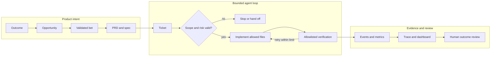

# Architecture and limitations

Agentic Development Operating System is a repository-native Python harness. Canonical product and delivery artifacts are Markdown and JSON; the Python standard-library core validates their relationships, controls bounded execution, and produces trace and metric evidence. GitHub Actions runs the same contracts remotely.

## System flow

The diagram represents the repository model at `22523bc78b7d65a4a90b9b01d08b681591fc662f`; it does not establish production adoption.

## Components and boundaries

| Component | Responsibility | Boundary |
| --- | --- | --- |
| `.ai/context/`, `.ai/strategy/`, `.ai/discovery/`, `.ai/bets/` | Canonical upstream product intent and evidence | A PRD cannot originate directly from conversation; it requires validated ancestry |
| `docs/prd/`, `docs/specs/`, `docs/tickets/` | Requirements, acceptance contracts, and bounded work | One ticket declares allowed paths, risk, verification, and stop conditions |
| `docs/trace/traceability.json` | Canonical end-to-end relationships | Generated Markdown and CSV are read-only compatibility outputs |
| `scripts/ados.py` | Command-line interface | Orchestrates library functions; it is not a published package entry point |
| `src/agentic_os/` | Product-chain, loop, telemetry, metric, and architecture logic | Python 3.11 standard library; declared boundaries prohibit hidden coupling |
| `agent/` | Agent instructions, risk tiers, approvals, and execution contracts | Ambiguous, irreversible, security-sensitive, or high-risk work exits the normal loop |
| `observability/` | Event schema, synthetic stream, alerts, metrics, and dashboard | Durable telemetry must not contain credentials or production personal data |
| `.github/workflows/` | Governance, portability, dependency, and CodeQL checks | Read-only repository access by default; platform settings remain owner-controlled |

## State and evidence lifecycle

A governed loop starts only after its ticket and upstream product chain are valid. It emits `loop.started`, records bounded actions, runs allowlisted verification without a shell, emits `verification.completed`, and stops with `success`, `failure`, or `handoff`. Retries require a non-sensitive reason and stop after the configured limit.

The system joins ticket, code, tests, events, metrics, and review records through stable identifiers. Human outcome review is intentionally outside automated self-consistency: passing validators proves contract consistency, not customer value.

## Security and privacy boundary

- The core does not require a network service, database, model provider, or paid runtime dependency.
- Repository content, tickets, event metadata, and agent-generated instructions are untrusted inputs.
- Verification commands are constrained to configured allowlisted argument vectors.
- R2 and R3 work requires approval bound to the exact ticket digest.
- Credentials, personal data, client data, production data, and private research must not enter committed artifacts, telemetry, examples, or visual evidence.
- The vulnerability-reporting path and support status are in [SECURITY.md](../SECURITY.md).

These controls reduce risk; they do not make the current source a hardened sandbox or production execution boundary.

## Known limitations

1. **Source-only distribution.** There is no tag, release, package, installer, migration tool, or supported update channel. Consumers must identify an evaluated snapshot by full commit SHA.
2. **Environment assumption.** The `make` workflow requires GNU Make and a Unix-like shell. Python supports 3.11+, but Windows-native setup is not documented or independently tested.
3. **No clean-room usability proof.** CI verifies the repository on GitHub-hosted Ubuntu; an unfamiliar tester has not completed the workflow using only public documentation. No five-minute claim is made.
4. **No portfolio coordinator.** This repository does not discover repositories, update consumers, or synchronize portfolio policy automatically.
5. **Synthetic operational evidence.** The demo, dashboard, and committed metrics exercise framework behavior with synthetic data, not customer or production behavior.
6. **Candidate adoption contract.** The portable contract does not install the harness or validate a consumer's domain, deployment, security, or product behavior.
7. **Incomplete learning round trip.** Versioning and successful acceptance by two unlike consumers remain required before canonicalization review.
8. **Human decisions remain external.** Product judgment, high-risk authorization, release approval, repository settings, and canonical status are not delegated.

## Recovery and rollback

- If verification fails, correct the canonical source, regenerate derived views with `python scripts/ados.py product export`, then rerun `make verify` and `make product`.
- If a loop exceeds retries or crosses scope, stop with `handoff`; do not weaken its ticket, risk, or verification gate.
- A consumer can roll back the portable caller by reverting its separately reviewed consumer commit. Product artifacts remain readable.
- Do not point consumers at `main` or an unreleased version string. Use an immutable evaluated commit and retain the previous SHA for rollback.

See the [pilot adoption contract](pilot/ADOPTION_CONTRACT.md) for gates that precede broader adoption.