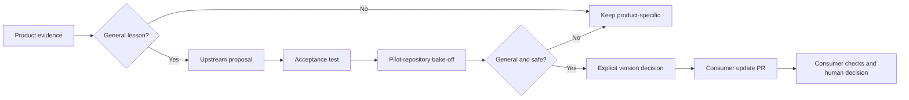

# Pilot adoption and learning contract

This contract defines how the candidate harness may be evaluated by `vantage` and `Tycoon`. It does not authorize installation, merging, release publication, or portfolio rollout.

## Version declaration

The repository currently declares source version `1.1.0`. Until an immutable tag or release exists, consumers must identify an evaluated snapshot by full commit SHA. They must not describe `1.1.0` as a released package.

A future consumer declaration should record:

- harness repository;
- immutable version or commit;
- adopted contracts or modules;
- local adapters and exceptions;
- verification commands;
- last successful compatibility check.

The exact file format is a pilot output, not a predetermined standard.

## Learning flow

A proposal is eligible for shared-harness treatment only when it includes:

1. the observed problem and product evidence;
2. why the lesson is general rather than product-specific;
3. a failing acceptance test or reproducible contract;
4. security and compatibility impact;
5. a rollback path.

No lesson is copied manually across repositories. No harness update silently changes consumers. Update pull requests are never merged automatically.

## Candidate core boundary

Potentially shared:

- ticket and scope contracts;
- risk tiers and approval semantics;
- trace identifiers and validation;
- agent operating rules;
- reusable verification and security checks;
- learning-proposal and compatibility contracts.

Local by default:

- product architecture and domain language;
- user data, credentials, integrations, and deployment;
- product-specific tests, telemetry, and metrics;
- marketing, pricing, and roadmap;
- exceptions required by a product's threat model.

## Compatibility rule

A change is backward-compatible only when current pilot consumers pass their declared checks without undocumented migration. Breaking changes require:

- an explicit decision record;
- a migration guide;
- a major-version decision;
- separately reviewable consumer pull requests;
- rollback evidence.

## First cross-product learning proposal

Evidence from both active product pilots showed the same portability failure class: committed machine-local configuration. That evidence is generalized as the [portable repository contract](PORTABLE_REPOSITORY_CONTRACT.md).

The harness contribution is a read-only reusable workflow with a positive profile run and synthetic detector self-tests. Consumers call the workflow by immutable merge SHA; they do not copy a harness folder or depend on an unpublished release.

This records product evidence → general classification → upstream implementation → acceptance run. It remains incomplete until consumer update pull requests pass their local checks and are explicitly accepted.

## Canonicalization gate

The harness may be proposed as canonical only after:

- all critical and high security findings are resolved;
- an unfamiliar user or agent completes the primary workflow from public documentation;
- at least one real general learning completes the full round trip;
- two distinct pilot products pass their local compatibility checks;
- operating effort and maintenance ownership are measured;
- the pilot retrospective explicitly recommends canonicalization.

Passing these gates permits a decision. It does not automatically create a release or roll the harness out.
